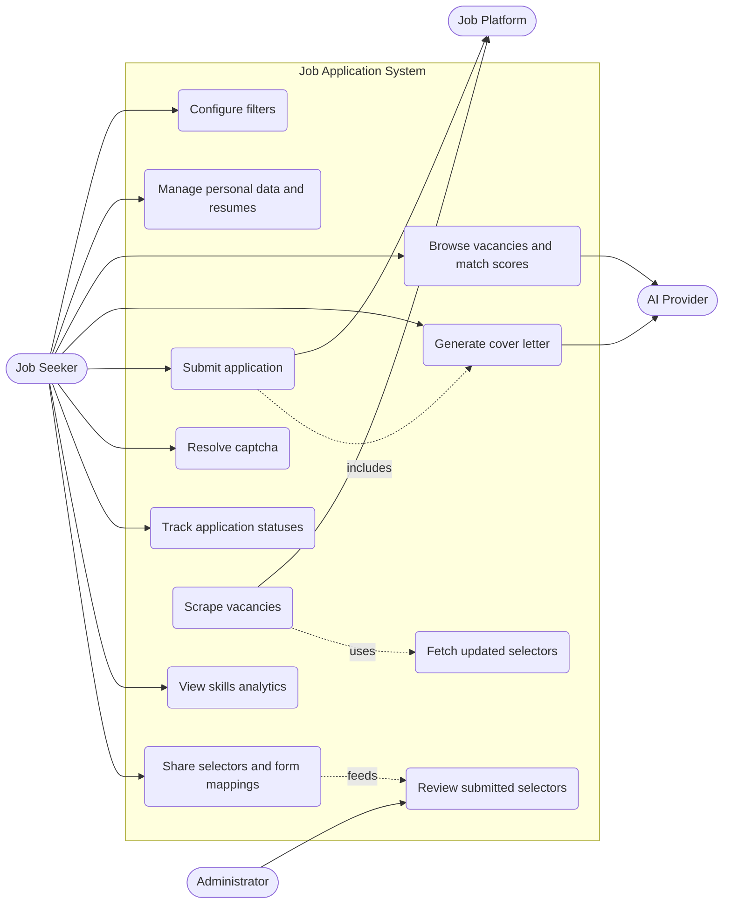

# Features, Epics & User Stories

## Epics

| ID | Epic | Component | Criterion |
|---|---|---|---|
| E1 | Vacancy collection | Extension, Backend | Back-end, Database |
| E2 | Dynamic selector registry | Backend, Extension | Back-end, Database |
| E3 | Application submission and form filling | Extension, PWA | Front-end |
| E4 | AI matching and cover letters | Extension, AI | AI Assistant |
| E5 | User dashboard and tracking | PWA | Front-end |
| E6 | Skills analytics | Backend, PWA | Back-end |
| E7 | Privacy and anonymous onboarding | Extension, Backend | Back-end |
| E8 | Mobile and tablet access | PWA | Adaptive UI |
| E9 | Deployment and API documentation | Infrastructure | Containerization, API documentation |

## User Stories

Priority: **M** = Must have, **S** = Should have, **C** = Could have.

### E1. Vacancy collection

| ID | As a… | I want to… | So that… | Priority |
|---|---|---|---|---|
| US-1.1 | job seeker | have the extension search job platforms in the background for my role | I do not have to visit each platform manually | M |
| US-1.2 | job seeker | have the extension scrape vacancies locally when the server has none for my role | I still get results for rare roles | M |
| US-1.3 | system | receive scraped vacancies from clients and remove duplicates | the database stays clean and useful | M |
| US-1.4 | job seeker | filter vacancies by my criteria | I only see relevant listings | M |

### E2. Dynamic selector registry

| ID | As a… | I want to… | So that… | Priority |
|---|---|---|---|---|
| US-2.1 | extension | periodically fetch up-to-date selectors from the server | scraping keeps working after a platform layout change | M |
| US-2.2 | job seeker | have updated selectors applied without restarting or reinstalling the extension | I experience no interruption | M |
| US-2.3 | job seeker | share selectors that worked for me | other users benefit from my fix | C |
| US-2.4 | administrator | review and approve submitted selectors before distribution | malicious or broken selectors are not spread | S |

### E3. Application submission and form filling

| ID | As a… | I want to… | So that… | Priority |
|---|---|---|---|---|
| US-3.1 | job seeker | have application forms filled automatically from my stored data | I do not retype the same information | M |
| US-3.2 | job seeker | have the extension guess field mappings on unknown forms | unfamiliar platforms still work | S |
| US-3.3 | job seeker | choose the resume variant, name and address for each application | each application is tailored | M |
| US-3.4 | job seeker | choose between manual, semi-automated and automatic submission | I stay in control | M |
| US-3.5 | job seeker | solve a captcha in the PWA when a platform requires it | the application can continue | C |
| US-3.6 | job seeker | generate a resume in PDF or DOC from a template | I can attach it to applications | S |
| US-3.7 | job seeker | share successful form mappings | others can apply faster | C |

### E4. AI matching and cover letters

| ID | As a… | I want to… | So that… | Priority |
|---|---|---|---|---|
| US-4.1 | job seeker | see a match score between my resume and each vacancy | I can prioritize | M |
| US-4.2 | job seeker | get a personalized cover letter for a vacancy | my application stands out | M |
| US-4.3 | job seeker | edit the generated letter before sending | I keep the final say | M |

### E5. User dashboard and tracking

| ID | As a… | I want to… | So that… | Priority |
|---|---|---|---|---|
| US-5.1 | job seeker | manage personal data and resume variants in the PWA | everything is in one place and stored locally | M |
| US-5.2 | job seeker | configure search filters | automated search reflects my preferences | M |
| US-5.3 | job seeker | track the status of every application | I know what has been sent and what happened | M |
| US-5.4 | job seeker | get a reminder to install the extension if it is missing | the system works as intended | S |

### E6. Skills analytics

| ID | As a… | I want to… | So that… | Priority |
|---|---|---|---|---|
| US-6.1 | job seeker | see the most frequent skills "hot words" for my target role | I know what to learn or emphasize | S |
| US-6.2 | job seeker | view analytics as charts in the dashboard | trends are easy to grasp | S |

### E7. Privacy and anonymous onboarding

| ID | As a… | I want to… | So that… | Priority |
|---|---|---|---|---|
| US-7.1 | job seeker | start using the system without registration | I do not have to give an email or password | M |
| US-7.2 | job seeker | keep credentials and personal data only on my device | my privacy is protected | M |
| US-7.3 | job seeker | store non-sensitive preferences under an anonymous profile | settings persist across sessions | S |

### E8. Mobile and tablet access

| ID | As a… | I want to… | So that… | Priority |
|---|---|---|---|---|
| US-8.1 | job seeker | open the dashboard on my phone or tablet | I can monitor and manage on the go | M |
| US-8.2 | job seeker | install the PWA to my home screen | it opens like an app | C |

### E9. Deployment and API documentation

| ID | As a… | I want to… | So that… | Priority |
|---|---|---|---|---|
| US-9.1 | developer | start the backend, collector and databases with one command in an isolated network | setup is reproducible | M |
| US-9.2 | developer | read a specification of all endpoints, formats and error structures | I can integrate the PWA and the extension correctly | M |

## Use Case Diagram

*Figure 1.1. Use case diagram of the system. Scraping and selector fetching run automatically in the extension; the Job Seeker configures and supervises them.*

## Feature List by Component

| Component | Features |
|---|---|
| **Browser extension** | Background and local scraping; dynamic selectors; adaptive form filling; AI request proxying; resume generation; local storage of personal data; captcha relay |
| **Backend** | Vacancy aggregation and deduplication; selector and config distribution; anonymous onboarding; hot-words analytics |
| **PWA** | Dashboard; filter settings; personal data in IndexedDB; manual and semi-automated applications; status tracking; analytics charts; adaptive layout |
| **AI** | Match score; cover letter generation |
| **Infrastructure** | Containerized services in an isolated network; API specification |
